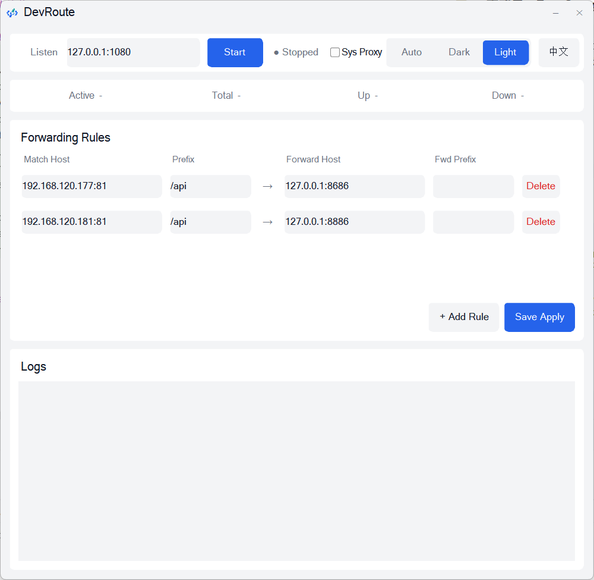
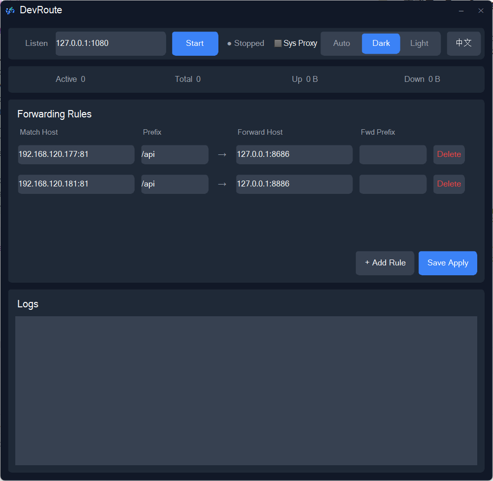

# devroute


[English](README_EN.md) | 中文

> A local forwarding tool for development & debugging: **extremely lightweight, ~3.5MB RAM idle with GUI (1.6MB headless)**, a single 2MB binary you can copy anywhere. One port serves both SOCKS5 and HTTP proxy protocols, forwarding by `Host + path prefix` with path rewriting. Ships with a GUI (rule editing / live stats / logs / system proxy integration), built in Rust + FLTK **fully native — no WebView (not Tauri/Electron)**, no embedded browser engine.

## Screenshots

| Light theme | Dark theme |
|---|---|
|  |  |

## Features

- **Dual-protocol proxy**: a single listening port auto-detects SOCKS5 and HTTP proxy traffic (CONNECT + absolute-form requests)
- **Rule-based forwarding**: match by `Host:Port` + request path prefix, forward to the target and rewrite the path prefix
- **On-page forwarding banner**: pages matching a rule get a translucent banner at top-center (matched path → forward target + prefix), making it obvious what's being forwarded; injected responses are marked `no-store` so the banner disappears once the proxy stops (pages cached before enabling need one hard refresh, Ctrl+F5)
- **Crash leftover cleanup**: system proxy settings left behind by an unexpected exit are detected and cleared on next launch — a dead proxy is never "restored"
- **Running-state icon**: taskbar and in-app icon change color with proxy start/stop (Windows / Linux X11; on macOS the Dock shows the app icon, but the in-app icon still reflects state)
- **GUI desktop app** (default): rule CRUD, save with hot reload, connection/traffic stats, live logs, one-click system proxy, light/dark theme, Chinese/English UI
- **Lightweight**: ~3.5MB idle with GUI (~4MB while proxying, grows with traffic); `--headless` mode starts at ~1.6MB, ideal for leaving running
- Auto-generates a default `config.toml`; config changes take effect immediately
- Failed forwards return 503 or fall back to the original address

## Quick Start

### Build Requirements

- Rust (edition 2024)
- Windows: CMake + MSVC (fltk compiles C++, `winget install Kitware.CMake`)
- macOS / Linux: cmake + a C++ toolchain

### Run

```bash
# GUI mode (default)
cargo run --release

# Headless proxy mode
cargo run --release -- --headless
```

A default `config.toml` is generated in the current directory on first run.

### Packaging & Distribution

```bash
cargo build --release
```

The output is a single `target/release/devroute.exe` (Windows); all dependencies (including the fltk GUI) are statically linked — no runtime to install, just copy the file anywhere and double-click.

- Double-click / run directly → GUI mode
- `devroute.exe --headless` → headless proxy mode

Note: the config file is `config.toml` in the **directory the program runs from**; it is auto-generated with defaults if missing.

### Using the GUI

- **Listen address**: local proxy port, default `127.0.0.1:1080`
- **System proxy**: when checked, starting the proxy writes system settings automatically (Windows registry / macOS networksetup / Linux gsettings), and reverts on stop or window close
- **Forwarding rules**: match host + path prefix → forward host + path prefix; click "Save & Apply" to write `config.toml` and hot reload (changing the listen address restarts the proxy thread)
- **Theme**: segmented control top-right — Auto / Dark / Light, applied instantly and remembered
- **Language**: button next to the theme control toggles Chinese/English, applied instantly and remembered

## Rule Configuration

Example `config.toml`:

```toml
listen_addr = "127.0.0.1:1080"
theme = "system"        # system | dark | light (GUI)
language = "auto"       # auto | zh | en (GUI; auto = follow system)
auto_proxy = false      # set system proxy on start (GUI)

[[rules]]
matcher = { addr = "192.168.120.177:81", path_prefix = "/api" }
forward = { addr = "127.0.0.1:8686", path_prefix = "" }
```

Field reference:

- `matcher.addr`: target `Host:Port` to match; `*` matches everything
- `matcher.path_prefix`: request path prefix to match
- `forward.addr`: address to forward to
- `forward.path_prefix`: prefix that replaces the original path prefix on forward (empty = strip the prefix)

Example: request `http://192.168.120.177:81/api/users` → forwarded to `http://127.0.0.1:8686/users`

## Usage

### Option 1: System proxy (recommended)

Check "System Proxy" in the GUI and start — browsers and most apps route through the proxy automatically.

### Option 2: ZeroOmega browser extension

1. Install the `ZeroOmega` extension in Chrome/Edge
2. Add a proxy: type `SOCKS5`, address `127.0.0.1:1080` (or just `socks5://127.0.0.1:1080`)
3. Configure rules as needed: route everything through the proxy and let `config.toml` split traffic, or only route the domains you're debugging

## Example Scenarios

### Local API forwarding

Browser requests `http://192.168.120.177:81/api/test` → forwarded to `http://127.0.0.1:8686/test`

### Multi-domain routing

```toml
[[rules]]
matcher = { addr = "api.example.com:80", path_prefix = "/service" }
forward = { addr = "127.0.0.1:8080", path_prefix = "/" }

[[rules]]
matcher = { addr = "*", path_prefix = "/static" }
forward = { addr = "127.0.0.1:8090", path_prefix = "/assets" }
```

## Project Structure

```text
src/
  main.rs            # Entry: --headless → CLI mode, otherwise GUI
  daemon.rs          # Proxy worker (tokio runtime + command channel + hot reload)
  core/
    socks.rs         # SOCKS5 handling + protocol sniffing (first byte 0x05)
    http.rs          # HTTP path rewriting + HTTP proxy (CONNECT / absolute-form) + on-page banner injection
    route.rs         # Route rule matching (hot-updated via RwLock)
    config.rs        # Config load/save (inline-table TOML)
    stats.rs         # Atomic connection/traffic counters
  ui/
    mod.rs           # GUI entry: theme detection, event loop, log channel
    view.rs          # Widget construction & flat styling (fltk)
    controller.rs    # Logic: start/stop, rule editing, saving, system proxy, theme & language switching
```

## License

MIT
